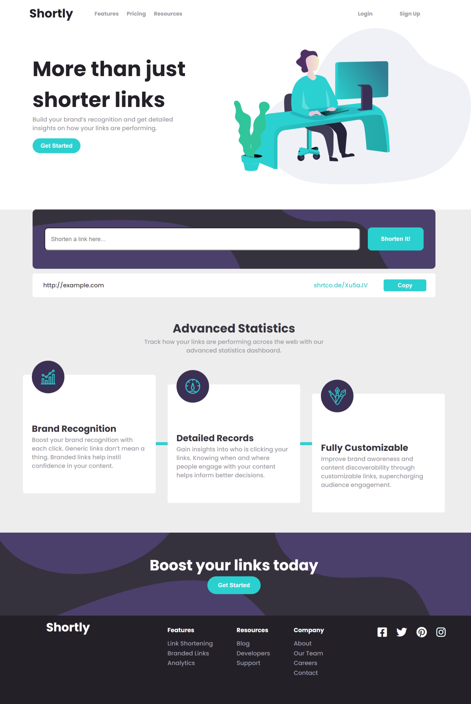

# Frontend Mentor - Shortly URL shortening API Challenge solution

This is a solution to the [Shortly URL shortening API Challenge challenge on Frontend Mentor](https://www.frontendmentor.io/challenges/url-shortening-api-landing-page-2ce3ob-G). Frontend Mentor challenges help you improve your coding skills by building realistic projects. 

## Table of contents

- [Overview](#overview)
  - [The challenge](#the-challenge)
  - [Screenshot](#my-solution-screenshot)
  - [Links](#links)
- [My process](#my-process)
  - [Built with](#built-with)
  - [Useful resources](#useful-resources)
- [Author](#author)

## Overview

### The challenge

Users should be able to:

- View the optimal layout for the site depending on their device's screen size
- Shorten any valid URL
- See a list of their shortened links, even after refreshing the browser
- Copy the shortened link to their clipboard in a single click
- Receive an error message when the `form` is submitted if:
  - The `input` field is empty

### My Solution Screenshot

### Links

- [Live site here](https://glexan14.github.io/URL-shortening-react/)
- [My Frontend Mentor solution here](https://www.frontendmentor.io/solutions/a-newbies-solution-react-hooks-and-redux-_JWsEzfiT)

## My process

### Built with

- Semantic HTML5 markup
- CSS custom properties
- Flexbox
- [React](https://reactjs.org/) - JS library
- [Redux](https://redux.js.org/) - JS library
- [ShrtCode](https://shrtco.de/) - API

### Useful resources

- [Font Awesome](https://fontawesome.com/) - I really liked this website to get some icons and will use it going forward.

- [W3Schools](https://www.w3schools.com/) - It's very useful. I'd recommend it to anyone still learning about programming.

- [RegExr](https://regexr.com/) - An online tool to learn, build, & test Regular Expressions(RegEx / RegExp). I recommend it.

- [Frontend Mentor](https://www.frontendmentor.io/challenges) - This website is really useful to put your frontend skills to test and practices. It also give you some resources to begin a challenge like this one.

## Author

- Frontend Mentor - [@GleXan14](https://www.frontendmentor.io/profile/GleXan14)
